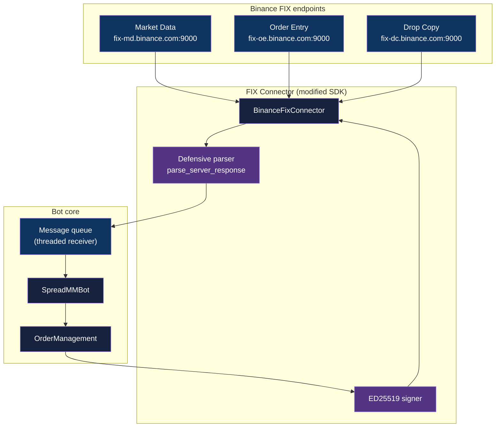
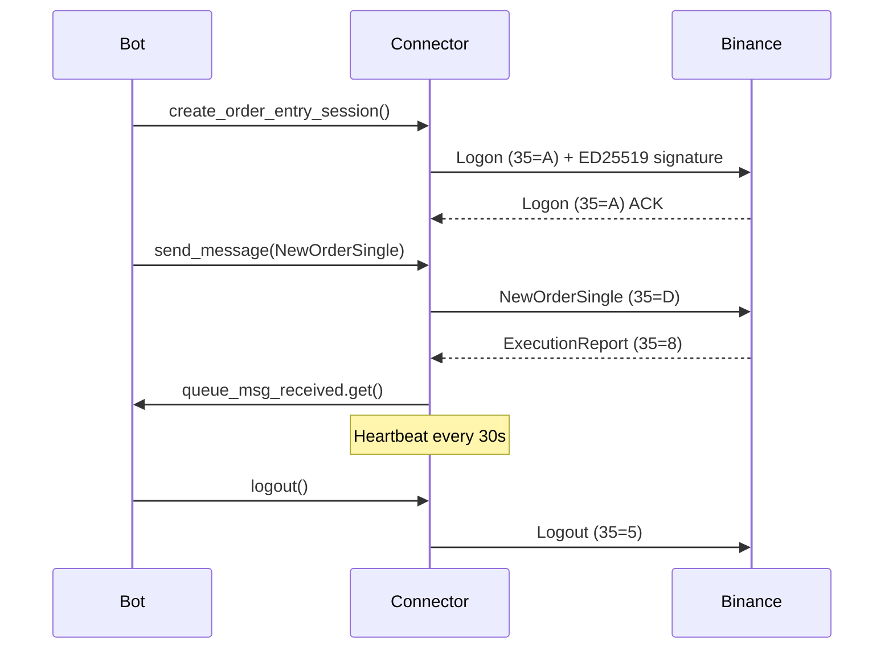
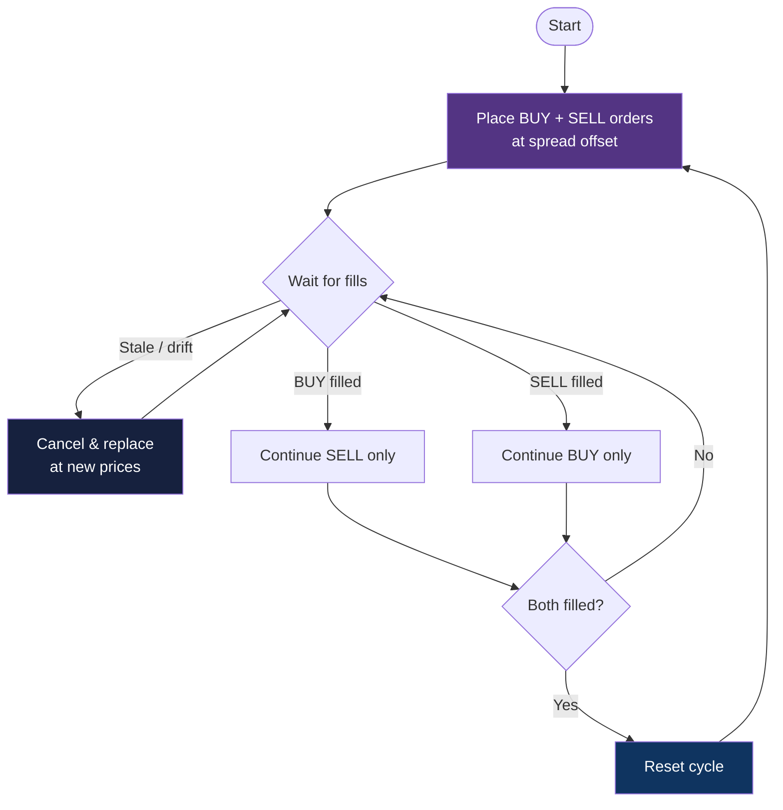

<div align="center">

# RATU FIX Bot

[](https://www.python.org/downloads/)
[](https://github.com/astral-sh/uv)
[](https://www.fixtrading.org/standards/fix-4-4/)
[](LICENSE)
[](https://github.com/adityonugrohoid/ratu-template)
[](#)

**Low-latency Binance FIX protocol bot — ED25519 auth, defensive message parsing, three-session architecture, and a spread market-making loop.**

[Getting Started](#getting-started) | [Architecture](#architecture) | [Market-Making Loop](#market-making-loop) | [SDK Modifications](#sdk-modifications)

</div>

---

> Part of the **RATU Project** (Real-time Automated Trading Unified) — system-prototyping focus on low-latency FIX protocol integration for market data and order entry.

## Table of Contents

- [Features](#features)
- [Tech Stack](#tech-stack)
- [Architecture](#architecture)
  - [FIX Message Flow](#fix-message-flow)
  - [Market-Making Loop](#market-making-loop)
- [Getting Started](#getting-started)
- [Usage](#usage)
- [How It Works](#how-it-works)
- [Project Structure](#project-structure)
- [Notable Code](#notable-code)
- [SDK Modifications](#sdk-modifications)
- [Architectural Decisions](#architectural-decisions)
- [Testing](#testing)
- [Roadmap](#roadmap)
- [License](#license)
- [Author](#author)

## Features

- **Three concurrent FIX sessions** — Market Data, Order Entry, Drop Copy on independent connections
- **ED25519 logon auth** — non-expiring asymmetric signature, no shared-secret API key on the wire
- **Defensive FIX parser** — gracefully skips malformed tag-value fields that crash the official SDK on certain symbols
- **Spread market-making loop** — places paired BUY/SELL quotes around best bid/ask, replaces on stale or drift
- **Tunable strategy** — spread %, stale threshold, qty, and log level all CLI-configurable
- **Order-lifecycle aware** — distinguishes pending/new/filled and cycles only when both sides clear

## Tech Stack

| Component | Technology |
|-----------|------------|
| Language | Python 3.10+ |
| Package manager | `uv` |
| FIX library | [`simplefix`](https://github.com/da4089/simplefix) |
| FIX SDK | Forked [`binance-fix-connector-python`](https://github.com/binance/binance-fix-connector-python) (defensive-parse mods) |
| Crypto | `cryptography` (ED25519 signing) |
| Config | `python-dotenv` + optional `config.ini` |
| Tests | `pytest`, `pytest-asyncio` |
| FIX version | FIX.4.4 |

## Architecture



### FIX Message Flow



### Market-Making Loop

The bot implements a simple **spread market-making** strategy that runs in an infinite loop:



**Quote pricing formula:**

```python
spread_offset = spread_percent / 200       # 0.01% → 0.00005

buy_price  = current_bid * (1 - spread_offset)   # below best bid
sell_price = current_ask * (1 + spread_offset)   # above best ask
```

**CLI parameters:**

| Parameter | Default | Description |
|-----------|---------|-------------|
| `--symbol` | `ETHFDUSD` | Trading pair |
| `--spread` | `0.01` | Spread offset % (`0.01` = 0.01%) |
| `--stale-threshold` | `2` | Seconds before refreshing quotes |
| `--qty` | `0.002` | Order quantity per side |
| `--log-level` | `INFO` | `DEBUG` / `INFO` / `WARNING` / `ERROR` |

## Getting Started

### Prerequisites

- Python 3.10+
- `uv` — see [install instructions](https://docs.astral.sh/uv/getting-started/installation/)
- A Binance account with **ED25519** API keys configured (Account → API Management → Edit → ED25519)
- ED25519 private key as a PEM file (saved to `secrets/ed25519_private.pem` by convention)

### Installation

```bash
git clone https://github.com/adityonugrohoid/ratu-fix-bot.git
cd ratu-fix-bot
uv sync
```

The bundled `src/binance_fix_connector/` is the modified SDK. To rebuild from upstream:

```bash
git clone https://github.com/binance/binance-fix-connector-python.git
cp -r binance-fix-connector-python/binance_fix_connector ./src/binance_fix_connector
# Re-apply the defensive-parse patch from src/binance_fix_connector/fix_connector.py
```

### Configuration

The bot accepts credentials in either of two forms (checked in order):

**Option A — environment variables (`.env`):**

```bash
cp .env.example .env
# Edit .env:
# BINANCE_ED25519_API_KEY=your_api_key_here
# BINANCE_ED25519_PRIV_PATH=secrets/ed25519_private.pem
```

**Option B — `config.ini`:**

```bash
cp examples/config.ini.example config.ini
# Edit config.ini:
# [keys]
# API_KEY = your_api_key_here
# PATH_TO_PRIVATE_KEY_PEM_FILE = secrets/ed25519_private.pem
```

## Usage

```bash
# Default config — reads .env, runs spread-MM on ETHFDUSD
uv run ratu-fix-bot

# Explicit config file
uv run ratu-fix-bot --config config.ini

# Override CLI parameters
uv run ratu-fix-bot --symbol BTCUSDT --qty 0.001 --spread 0.05 --stale-threshold 5

# Help
uv run ratu-fix-bot --help

# Standalone examples (use the connector directly)
uv run python examples/trade/new_order.py
uv run python examples/maket_stream/ticker_stream.py
```

### Sample terminal output

```
2025-12-13 10:12:26 INFO  FIX Client: Connected to tcp+tls://fix-md.binance.com:9000
2025-12-13 10:12:26 INFO  LOGIN (A)
2025-12-13 10:12:26 INFO  Client=>Server: 8=FIX.4.4|9=251|35=A|49=BMDWATCH|56=SPOT|34=1|...
2025-12-13 10:12:26 INFO  MD session established
2025-12-13 10:12:27 INFO  OE session established
2025-12-13 10:12:27 INFO  Sent InstrumentListRequest for ETHFDUSD
2025-12-13 10:12:27 INFO  Validated: MinQty=0.0001, MinPriceInc=0.01
2025-12-13 10:12:27 INFO  Subscribed to ETHFDUSD ticker stream
2025-12-13 10:12:28 INFO  Stale or missing orders detected: Bid=3092.48, Ask=3092.7
2025-12-13 10:12:29 INFO  Placed BUY order:  ClOrdID=buy_..., Price=3092.29
2025-12-13 10:12:29 INFO  Placed SELL order: ClOrdID=sell_..., Price=3092.83
2025-12-13 10:12:29 INFO  Order confirmed: Status=New
2025-12-13 10:12:30 INFO  Quote orders placed, awaiting further action
```

> FIX messages use `|` as field separator. Key tags: `35=A` (Logon), `35=D` (NewOrderSingle), `35=V` (MarketDataRequest), `35=8` (ExecutionReport), `54=1/2` (Buy/Sell).

## How It Works

### 1. Three FIX sessions

Each session is a long-lived TLS socket maintained by `BinanceFixConnector`:

| Session | Endpoint | Purpose |
|---------|----------|---------|
| Market Data | `tcp+tls://fix-md.binance.com:9000` | Subscribe to ticker / book / trade streams |
| Order Entry | `tcp+tls://fix-oe.binance.com:9000` | Send `NewOrderSingle`, receive `ExecutionReport` |
| Drop Copy | `tcp+tls://fix-dc.binance.com:9000` | Independent fill confirmations (audit trail) |

A background receiver thread reads from each socket into a shared queue; the bot consumes from the queue without blocking on I/O.

### 2. ED25519 logon

The Logon message (`35=A`) carries the request signed with the local ED25519 private key. Binance verifies with the public key registered in the user's API settings. No shared secret traverses the wire and the keypair never expires.

### 3. Spread market-making cycle

On every tick of the market-data stream, the bot compares its outstanding orders against the live best bid/ask. If either side is stale (older than `--stale-threshold` seconds) or has drifted off the desired spread, it cancels and re-places at the new price. When both sides fill within the same cycle, the loop resets.

### 4. Defensive parsing

The original Binance SDK parser raises on malformed tag-value fields that occasionally appear in market-data symbols. The fork in `src/binance_fix_connector/fix_connector.py` skips those fields and continues, logging once for visibility — see [SDK Modifications](#sdk-modifications) for the diff.

## Project Structure

```
ratu-fix-bot/
├── src/
│   ├── binance_fix_connector/    # Forked Binance FIX SDK with defensive parser
│   │   ├── fix_connector.py      #   parse_server_response (modified)
│   │   └── utils.py              #   Key loading helpers
│   └── ratu_fix_bot/             # Bot package
│       ├── core/
│       │   ├── bot.py            #   SpreadMMBot
│       │   ├── market_data.py    #   Market-data subscription + tick loop
│       │   ├── order_management.py # Place / cancel / replace
│       │   └── session.py        #   FIX session lifecycle
│       ├── config.py             #   Bot configuration loader
│       └── main.py               #   CLI entrypoint
├── examples/                     # Direct connector usage (no bot)
│   ├── trade/                    #   new_order.py, list_OTO_order.py
│   ├── maket_stream/             #   ticker / depth / trade streams
│   └── general/                  #   instrument list, rate limits
├── tests/
│   ├── test_fix_connector.py
│   ├── trade/                    # New-order / OTO unit tests
│   ├── market_stream/            # Stream parser tests
│   └── test_ratu_fix_bot/        # Bot-level unit tests
├── .env.example
├── pyproject.toml
└── NOTABLE_CODE.md
```

## Notable Code

> See [NOTABLE_CODE.md](NOTABLE_CODE.md) for annotated walk-throughs of the defensive parser modifications, ED25519 authentication path, three-session architecture, and the spread market-making loop.

## SDK Modifications

The bundled `binance_fix_connector` is a fork of the official [Binance FIX SDK](https://github.com/binance/binance-fix-connector-python) with defensive parsing applied to `parse_server_response` in `src/binance_fix_connector/fix_connector.py`:

```diff
 def parse_server_response(self) -> list[FixMessage]:
+    # --- Malformed tag-value field detection (skip and log) ---
+    malformed = [
+        s for s in tag_values
+        if '=' not in s or (s.startswith('8=') and s != f'8={self.fix_version}')
+    ]
+    if malformed:
+        continue  # Do not process this message

+    # --- Complete-message check with exception handling ---
+    try:
+        fix_msg = FixMessage()
+        fix_msg.append_strings([s for s in tag_values if '=' in s])
+        messages.append(fix_msg)
+    except Exception:
+        continue  # Skip this message on error
```

**Why:** the original SDK parser crashes on certain market-data symbols whose payload contains malformed tag-value fields. The fork degrades gracefully, dropping just the bad message rather than tearing down the session.

## Architectural Decisions

### 1. FIX over REST/WebSocket

**Decision:** Use Binance's FIX endpoints rather than REST or the WebSocket Streams API.

**Reasoning:** FIX gives sub-millisecond order entry latency and a session-level audit trail (Drop Copy). For a market-maker that re-quotes on tick, even small per-message overhead compounds across thousands of cycles per minute.

### 2. ED25519 over HMAC

**Decision:** Use Binance's ED25519 logon auth instead of the older HMAC-signed REST flow.

**Reasoning:** No shared secret on the wire, no expiring keys, and rotation just means publishing a new public key in the account settings. The cost is one extra setup step (PEM file) — negligible for the security gain.

### 3. Forked SDK with defensive parse

**Decision:** Maintain a local fork of the Binance FIX SDK rather than monkey-patching at runtime.

**Reasoning:** The patch touches a hot path (`parse_server_response`); a runtime monkeypatch would obscure stack traces and make CI / type-checking lie. A vendored fork keeps the modification visible and reviewable in git.

### 4. Threaded receiver, not async

**Decision:** Receive FIX messages on a daemon thread and hand to the strategy via queue.

**Reasoning:** The official SDK is sync; rewriting it to async would multiply the maintenance burden. A single dedicated receiver thread gives the same non-blocking semantics for the strategy loop without dragging in `asyncio` complexity.

## Testing

```bash
uv run pytest -v
```

| Module | Coverage |
|--------|----------|
| `tests/test_fix_connector.py` | Connector unit tests, defensive-parse cases |
| `tests/trade/` | NewOrderSingle and OTO order construction |
| `tests/market_stream/` | Book ticker / depth / trade stream parsing |
| `tests/test_ratu_fix_bot/` | Bot config + lifecycle |
| `tests/general/` | Rate-limit + instrument-list flows |

> Test bench includes a checked-in unit-test ED25519 key (`tests/unit_test_key.pem`) — synthetic only, never used against a live account.

## Roadmap

- [x] Three-session FIX architecture (MD / OE / DC)
- [x] ED25519 logon auth
- [x] Defensive parser for malformed market-data messages
- [x] Spread market-making loop with stale-order replacement
- [ ] Multi-symbol parallel quoting
- [ ] Inventory-skew adjustment to spread
- [ ] Prometheus metrics export

## License

MIT — see [LICENSE](LICENSE).

## Author

**Adityo Nugroho** ([@adityonugrohoid](https://github.com/adityonugrohoid))
