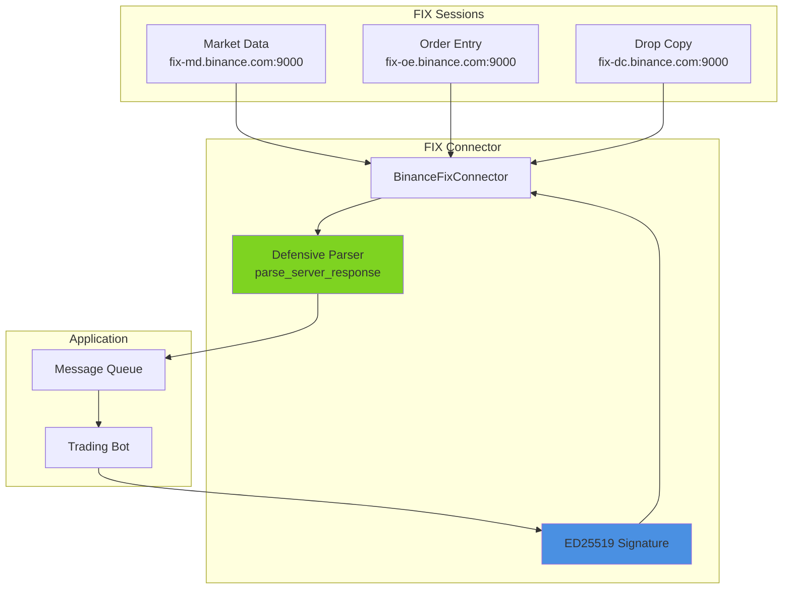
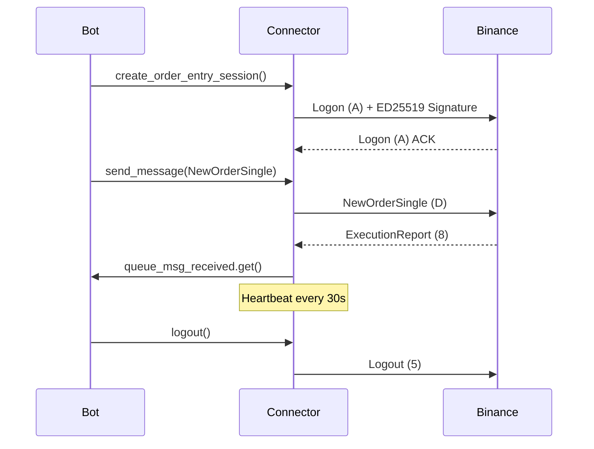
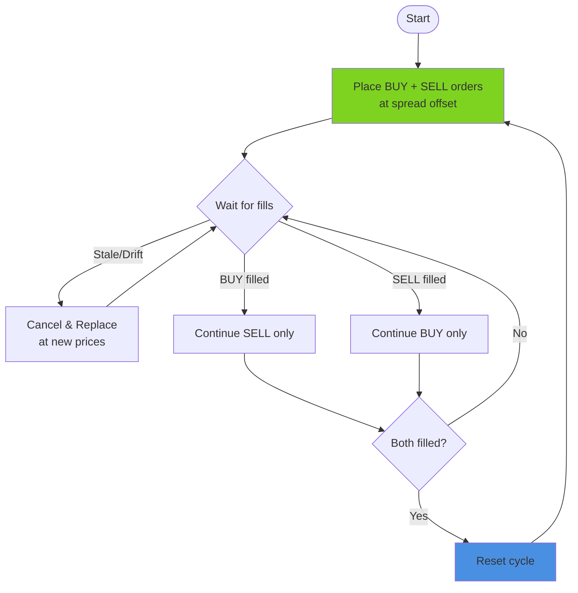

# RATU FIX Bot

[Python 3.10+](https://www.python.org/downloads/) | [uv](https://github.com/astral-sh/uv) | [RATUProject](https://github.com/adityonugrohoid)

FIX protocol connector for Binance with defensive message parsing.


## Production Readiness

**Level: MVP**

This system demonstrates production-focused FIX protocol integration with:
- **Defensive parser modifications** handling malformed FIX messages gracefully
- **ED25519 authentication** for secure, non-expiring API access
- **Three-session architecture** (Market Data, Order Entry, Drop Copy)
- **Spread market making strategy** with price chasing

> **System Prototyping Focus**: Low-latency FIX protocol integration for market data and order entry

## Part of RATUProject

This repository is part of **RATUProject** (Real-time Automated Trading Unified) - an open-source portfolio demonstrating real-time, event-driven system design for financial markets and blockchain integrations.

## Features

| Feature | Description |
|---------|-------------|
| **Market Data Session** | Real-time FIX market data streaming |
| **Order Entry Session** | FIX order execution with ED25519 auth |
| **Drop Copy Session** | Trade confirmations and fills |
| **Defensive Parser** | Robust handling of malformed FIX messages |

## System Overview



## FIX Message Flow



## Market Making Loop

The bot implements a simple **spread market making** strategy that runs in an infinite loop:



### Quote Pricing Formula

```python
spread_offset = spread_percent / 200  # 0.01% → 0.00005

buy_price  = current_bid × (1 - spread_offset)  # Below best bid
sell_price = current_ask × (1 + spread_offset)  # Above best ask
```

### Configuration Parameters

| Parameter | Default | Description |
|-----------|---------|-------------|
| `--spread` | 0.01 | Spread offset % (0.01 = 0.01%) |
| `--stale-threshold` | 2 | Seconds before order refresh |
| `--qty` | 0.002 | Order quantity per side |
| `--log-level` | INFO | DEBUG, INFO, WARNING, ERROR |

### Terminal Output

```
2025-12-13 10:12:26,408 INFO Bot initialized
2025-12-13 10:12:26,659 INFO ----------------------------------------------------------------------------------------------------
2025-12-13 10:12:26,659 INFO FIX Client (100.104.123.216:53040): Connected to tcp+tls://fix-md.binance.com:9000
2025-12-13 10:12:26,660 INFO ----------------------------------------------------------------------------------------------------
2025-12-13 10:12:26,660 INFO LOGIN (A)
2025-12-13 10:12:26,661 INFO Client=>Server: 8=FIX.4.4|9=251|35=A|49=BMDWATCH|56=SPOT|34=1|...
2025-12-13 10:12:26,853 INFO MD session established, SessionID=a9d0cd74-f022-446a-a0b8-0f8b6a58de33
2025-12-13 10:12:26,853 INFO MD session kept open
2025-12-13 10:12:27,093 INFO ----------------------------------------------------------------------------------------------------
2025-12-13 10:12:27,093 INFO FIX Client (100.104.123.216:53041): Connected to tcp+tls://fix-oe.binance.com:9000
2025-12-13 10:12:27,093 INFO ----------------------------------------------------------------------------------------------------
2025-12-13 10:12:27,093 INFO LOGIN (A)
2025-12-13 10:12:27,093 INFO Client=>Server: 8=FIX.4.4|9=266|35=A|49=BOETRADE|56=SPOT|34=1|...
2025-12-13 10:12:27,280 INFO OE session established, SessionID=9012955e-0cf4-44e8-b464-ea71be44efaf
2025-12-13 10:12:27,280 INFO OE session kept open
2025-12-13 10:12:27,280 INFO Client=>Server: 8=FIX.4.4|9=98|35=x|49=BMDWATCH|56=SPOT|34=2|320=GetInstrumentList|559=0|55=ETHFDUSD|...
2025-12-13 10:12:27,280 INFO Sent InstrumentListRequest for ETHFDUSD
2025-12-13 10:12:27,381 INFO Validated: MinQty=0.0001, MinPriceInc=0.01
2025-12-13 10:12:27,381 INFO Instrument validation complete
2025-12-13 10:12:27,382 INFO Client=>Server: 8=FIX.4.4|9=135|35=V|49=BMDWATCH|262=BOOK_TICKER_STREAM|55=ETHFDUSD|...
2025-12-13 10:12:27,382 INFO Subscribed to ETHFDUSD ticker stream
2025-12-13 10:12:27,710 INFO Starting persistent ticker stream
2025-12-13 10:12:27,710 INFO Background ticker stream started
2025-12-13 10:12:28,715 INFO Stale or missing orders detected: Bid=3092.48, Ask=3092.7
2025-12-13 10:12:28,715 INFO No active orders to cancel
2025-12-13 10:12:29,715 INFO Client=>Server: 8=FIX.4.4|35=D|11=buy_1765595549715962880|44=3092.29000000|54=1|55=ETHFDUSD|...
2025-12-13 10:12:29,715 INFO Placed BUY order: ClOrdID=buy_1765595549715962880, Price=3092.29
2025-12-13 10:12:29,715 INFO Client=>Server: 8=FIX.4.4|35=D|11=sell_1765595549715962880|44=3092.83000000|54=2|55=ETHFDUSD|...
2025-12-13 10:12:29,716 INFO Placed SELL order: ClOrdID=sell_1765595549715962880, Price=3092.83
2025-12-13 10:12:29,817 INFO Order confirmed: ClOrdID=buy_1765595549715962880, Status=New
2025-12-13 10:12:29,917 INFO Order confirmed: ClOrdID=sell_1765595549715962880, Status=New
2025-12-13 10:12:30,721 INFO Quote orders placed, awaiting further action
```

> FIX messages use `|` as field separator. Key tags: `35=A` (Logon), `35=D` (NewOrderSingle), `35=V` (MarketDataRequest), `54=1/2` (Buy/Sell)

## Installation

### 1. Clone Repository

```bash
git clone https://github.com/adityonugrohoid/ratu-fix-bot.git
cd ratu-fix-bot
```

### 2. Install Binance FIX SDK (Editable)

This project requires the official Binance FIX Python SDK. Clone and install as editable:

```bash
# Clone the official Binance FIX connector
git clone https://github.com/binance/binance-fix-connector-python.git

# Install as editable package
cd binance-fix-connector-python
pip install -e .
cd ..

# Alternative: Copy SDK module to project src/
cp -r binance-fix-connector-python/binance_fix_connector ./src/binance_fix_connector
```

> **Note**: The SDK is included in `src/binance_fix_connector/` with defensive parsing modifications. You can skip this step if using the bundled version.

### 3. Sync Dependencies & Configure

```bash
# Sync dependencies
uv sync

# Verify installation
uv run python -c "from binance_fix_connector.fix_connector import BinanceFixConnector; print('OK')"
```

### 4. Configure Credentials

The bot supports two credential formats (checked in order):

**Option A: Environment Variables (Recommended)**

```bash
# Create .env from example
cp .env.example .env

# Edit .env with your credentials
# BINANCE_ED25519_API_KEY=your_api_key_here
# BINANCE_ED25519_PRIV_PATH=secrets/ed25519_private.pem
```

**Option B: config.ini file**

```bash
# Create config from example
cp examples/config.ini.example config.ini

# Edit config.ini
# [keys]
# API_KEY = your_api_key_here
# PATH_TO_PRIVATE_KEY_PEM_FILE = secrets/ed25519_private.pem
```

> **ED25519 Key Setup**: Generate an ED25519 key pair in your Binance account settings. Save the private key to `secrets/ed25519_private.pem`.

### 5. Run Bot

```bash
# Run with CLI (uses .env by default)
uv run ratu-fix-bot

# Or specify config.ini explicitly
uv run ratu-fix-bot --config config.ini

# Run examples
uv run python examples/order_entry.py

# Run tests
uv run pytest
```

## Project Structure

```
ratu-fix-bot/
  src/
    binance_fix_connector/   # FIX protocol connector
      fix_connector.py       # Main connector with defensive parser
      utils.py               # Key loading helpers
    ratu_fix_bot/            # Market making bot package
      core/                  # Core modules
        bot.py               # SpreadMMBot class
        market_data.py       # Market data streaming
        order_management.py  # Order placement/cancellation
        session.py           # FIX session management
      config.py              # Bot configuration
      main.py                # CLI entry point
  examples/                  # Usage examples
  tests/                     # Unit tests
  _reference/                # Archived scripts
```

### CLI Usage

```bash
# Run with default configuration
uv run ratu-fix-bot --config config.ini

# Run with custom parameters
uv run ratu-fix-bot --symbol BTCUSDT --qty 0.001 --spread 0.05 --stale-threshold 5

# Show all options
uv run ratu-fix-bot --help
```

## SDK Modifications

The following modifications were made to the official Binance FIX SDK for robustness:

**File:** `src/binance_fix_connector/fix_connector.py`

### `parse_server_response` (Lines 403-478)

Replaces the original `parse_server_response_original` with a defensive parser:

```diff
 def parse_server_response(self) -> list[FixMessage]:
+    # --- Malformed tag-value field detection (skip and log) ---
+    malformed = [
+        s for s in tag_values
+        if '=' not in s or (s.startswith('8=') and s != f'8={self.fix_version}')
+    ]
+    if malformed:
+        continue  # Do not process this message

+    # --- Complete message check with exception handling ---
+    try:
+        fix_msg = FixMessage()
+        fix_msg.append_strings([s for s in tag_values if '=' in s])
+        messages.append(fix_msg)
+    except Exception:
+        continue  # Skip this message on error
```

> **Reason**: The original Binance SDK parser crashes on certain market data symbols with malformed FIX messages. This fix provides graceful degradation.

## Design Decisions

| Decision | Rationale |
|----------|-----------|
| FIX Protocol | Sub-millisecond latency for order execution |
| ED25519 | Secure, non-expiring authentication |
| Defensive Parser | Graceful handling of malformed messages |
| Thread-based Receiver | Non-blocking message reception |

## Protocol Reference

| Session | Endpoint | FIX Version |
|---------|----------|-------------|
| Market Data | `tcp+tls://fix-md.binance.com:9000` | FIX.4.4 |
| Order Entry | `tcp+tls://fix-oe.binance.com:9000` | FIX.4.4 |
| Drop Copy | `tcp+tls://fix-dc.binance.com:9000` | FIX.4.4 |

For more information, see [Binance FIX API Documentation](https://developers.binance.com/docs/binance-spot-api-docs/fix-api).

## Notable Code

This repository demonstrates production-focused FIX protocol integration patterns. See [NOTABLE_CODE.md](NOTABLE_CODE.md) for detailed code examples highlighting:

- Defensive parser modifications
- ED25519 authentication implementation
- Three-session FIX architecture

## License

MIT License - see [LICENSE](LICENSE) for details.

## Author

**Adityo Nugroho**  
- Portfolio: https://adityonugrohoid.github.io  
- GitHub: https://github.com/adityonugrohoid  
- LinkedIn: https://www.linkedin.com/in/adityonugrohoid/
